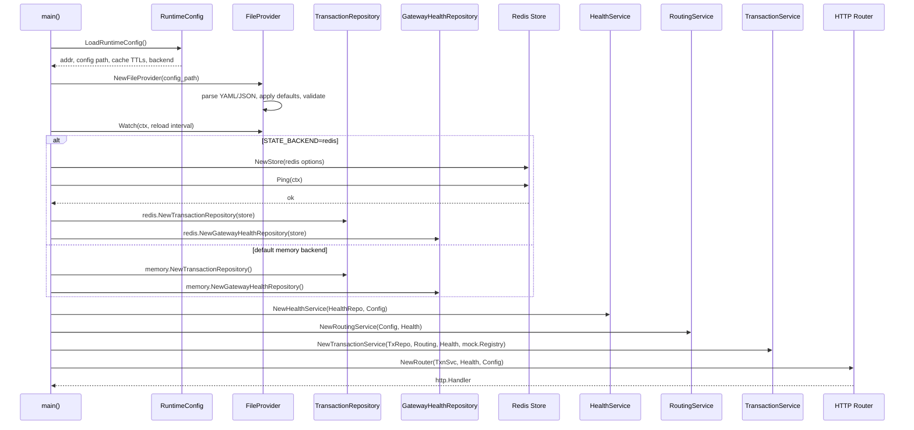
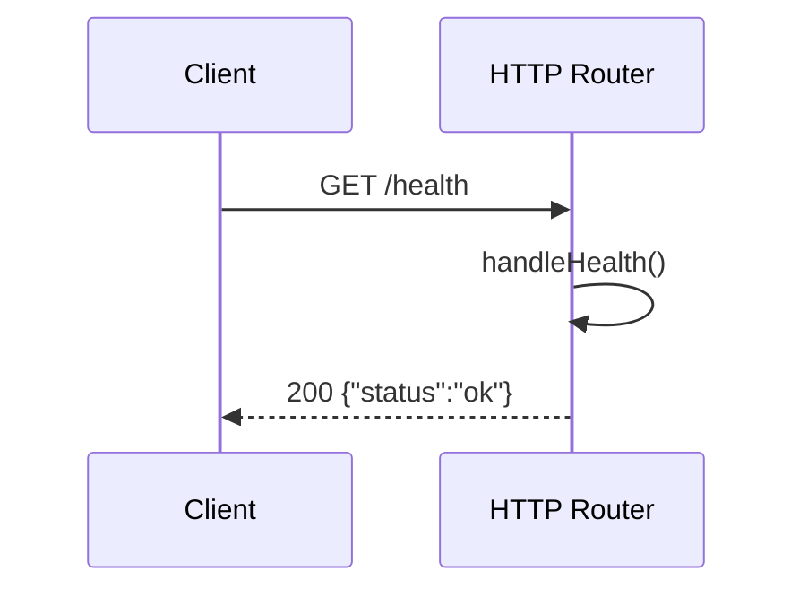
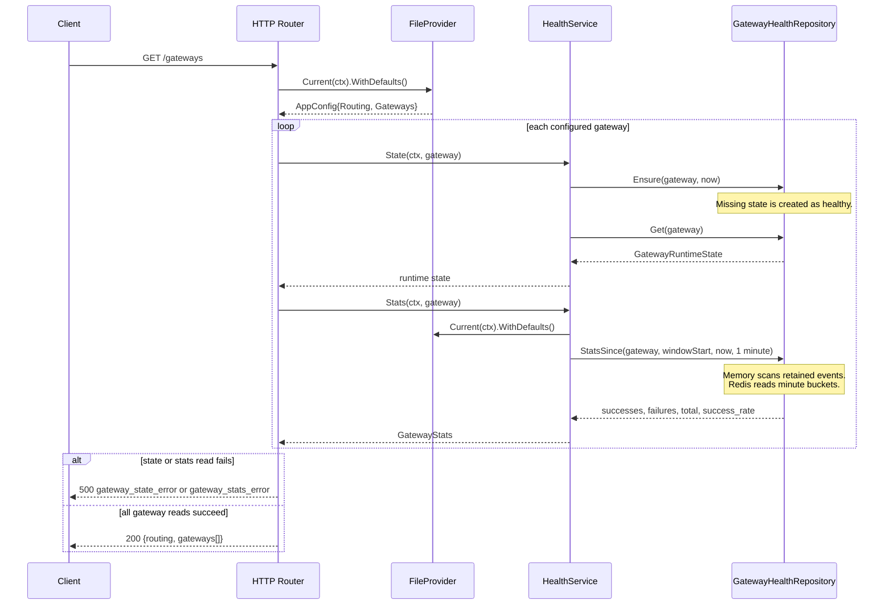
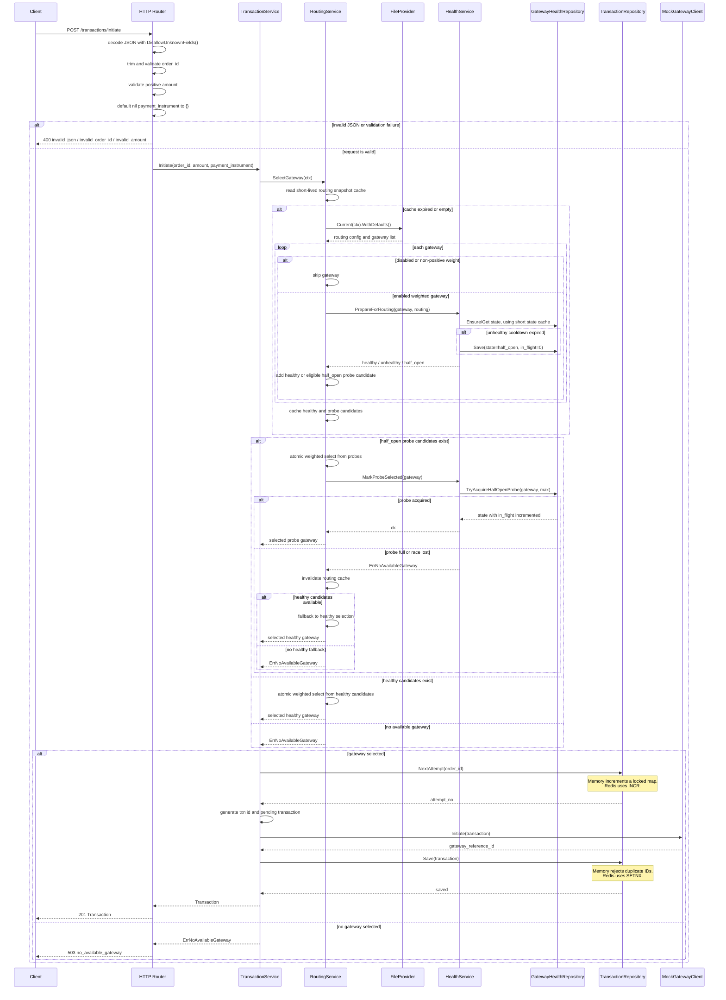
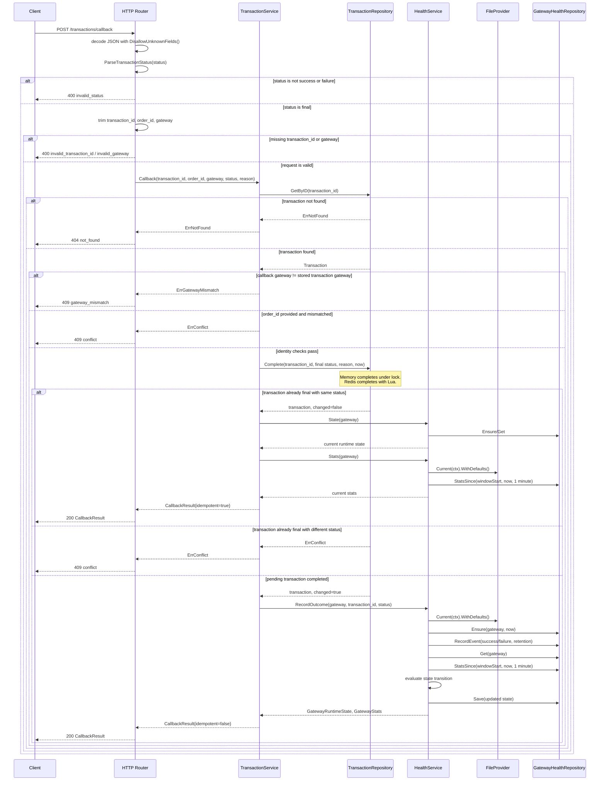
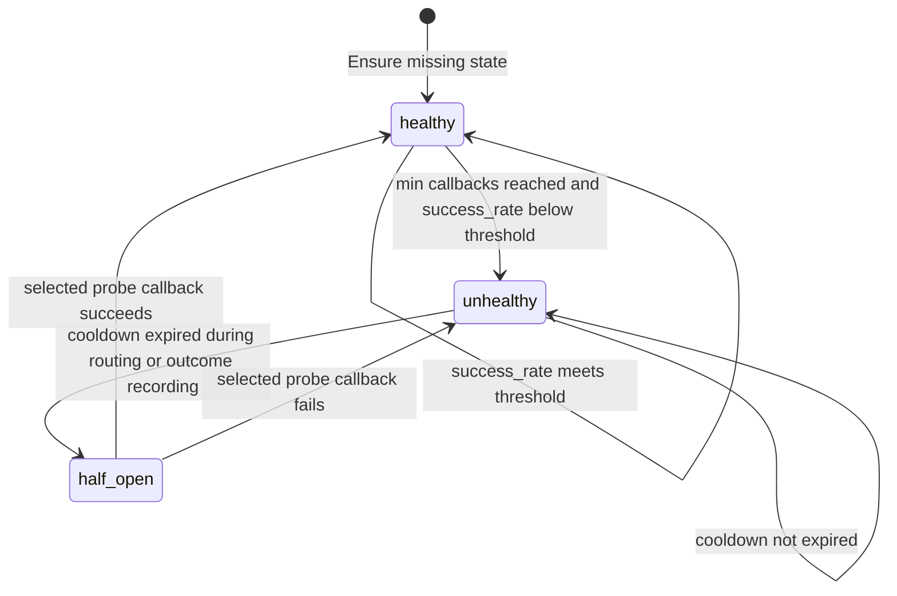
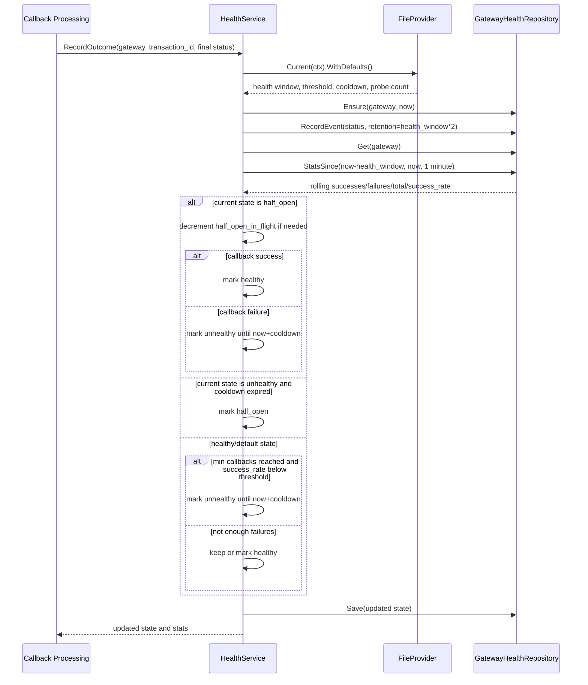
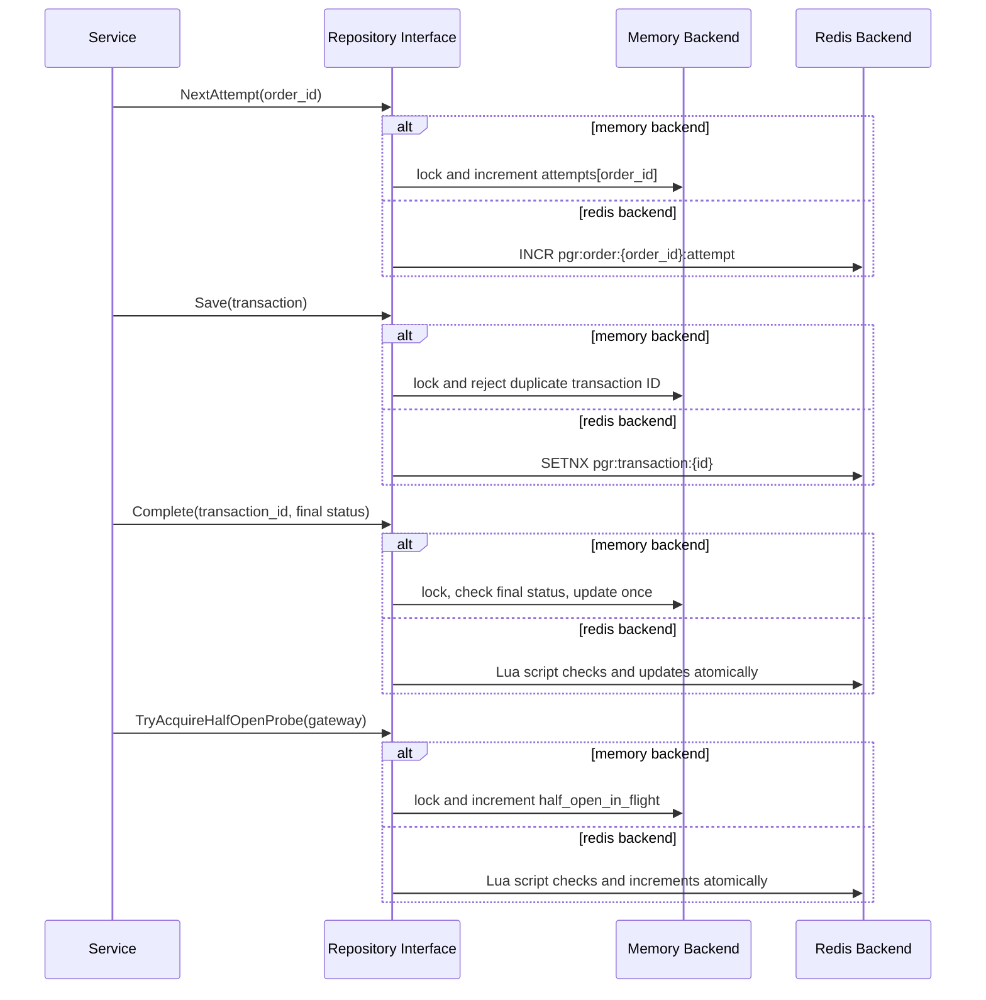

# Payment Gateway Router

Config-driven Go service for dynamic payment gateway routing.

## Features

- `POST /transactions/initiate`
- `POST /transactions/callback`
- In-memory transaction and gateway health state behind repository interfaces
- Redis-backed shared state for horizontal replicas
- Atomic weighted routing with short-lived local snapshots
- Config-driven gateway onboarding and weight changes
- Runtime config reload from mounted file, no Docker rebuild needed
- Gateway health state machine: `healthy -> unhealthy -> half_open -> healthy`
- Configurable success threshold, health window, cooldown, callback minimum, and probe count
- Idempotent duplicate callbacks
- Mock payment gateway clients
- Standard-library HTTP stack and tests

## Run With Docker

```bash
docker compose up --build
```

The config file is mounted from:

```text
./configs/gateways.yaml
```

Edit gateway weights, enabled flags, or routing thresholds in that file. The service polls the file and applies the last valid config automatically without rebuilding the image.

Compose starts Redis and configures the service with:

```text
STATE_BACKEND=redis
REDIS_ADDR=redis:6379
```

For multiple app replicas:

```bash
docker compose up --build --scale payment-gateway-router=3
```

When scaling with published ports, use a load balancer or remove the fixed host port mapping from each replica.

## Make Targets

The Makefile uses Docker Compose by default, so Go does not need to be installed on the host.

```bash
make help       # list available targets
make deps       # tidy dependencies
make test       # run Go tests
make verify     # format and test
make build      # build the app image
make up         # start app and Redis
make down       # stop services
make restart    # restart the app service
make rebuild    # rebuild and restart the app service
make logs       # follow app logs
make simulator  # run the traffic simulator
make clean      # stop services and remove volumes
```

## API

### Initiate Transaction

```bash
curl -X POST http://localhost:8080/transactions/initiate \
  -H "Content-Type: application/json" \
  -d '{
    "order_id": "ORD123",
    "amount": 499,
    "payment_instrument": {
      "type": "card",
      "card_number": "****",
      "expiry": "12/30"
    }
  }'
```

Response:

```json
{
  "transaction_id": "txn_...",
  "order_id": "ORD123",
  "attempt_no": 1,
  "amount": 499,
  "gateway": "razorpay",
  "gateway_reference_id": "mock_razorpay_txn_...",
  "status": "pending"
}
```

### Gateway Callback

```bash
curl -X POST http://localhost:8080/transactions/callback \
  -H "Content-Type: application/json" \
  -d '{
    "transaction_id": "txn_...",
    "order_id": "ORD123",
    "gateway": "razorpay",
    "status": "success"
  }'
```

For now every gateway is assumed to use the same callback payload shape. `transaction_id` is generated by this service and is the source of truth.

### Inspect Gateway State

```bash
curl http://localhost:8080/gateways
```

### Health Check

```bash
curl http://localhost:8080/health
```

## Request Flow Diagrams

The HTTP surface is registered in `internal/adapters/http/router.go` and currently exposes four routes:

| Method | Route | Purpose |
| --- | --- | --- |
| `GET` | `/health` | Process liveness check. |
| `GET` | `/gateways` | Current gateway config, runtime health state, and rolling callback stats. |
| `POST` | `/transactions/initiate` | Create a pending transaction and initiate it on a selected gateway. |
| `POST` | `/transactions/callback` | Finalize a transaction exactly once and update gateway health from the outcome. |

Runtime storage is selected during boot in `cmd/payment-gateway-router/main.go`: `STATE_BACKEND=memory` is the default, and `STATE_BACKEND=redis` swaps both transaction and gateway health repositories to Redis after a successful `PING`.



### `GET /health`

`/health` is intentionally shallow. It confirms that the process can serve HTTP, but it does not check Redis, gateway config validity after startup, configured downstream gateways, or repository health.



Important behavior:

- Always returns `200 OK` while the process is serving requests.
- Does not call the service layer or any repository.
- Should be treated as liveness, not a deep readiness or dependency-health endpoint.

### `GET /gateways`

`/gateways` returns the hot-reloaded routing config plus runtime state and rolling stats for every configured gateway. It includes disabled gateways too, because it iterates over the complete config snapshot.



Important behavior:

- Config is read through the `FileProvider`, so edits to `configs/gateways.yaml` are reflected after the reload interval if the file remains valid.
- `HealthService.State()` calls `Ensure()` before `Get()`, so first inspection initializes a missing runtime state as `healthy`.
- `HealthService.Stats()` uses the configured `health_window_seconds`.
- Memory stats are process-local event scans.
- Redis stats are stored as per-minute success/failure hash buckets with TTL.
- Any state or stats error stops the loop and returns `500`.

### `POST /transactions/initiate`

Initiation validates input, selects a gateway through the routing service, creates the next attempt for the order, calls the mock gateway client, and stores the transaction as `pending`.



Important behavior:

- Unknown JSON fields are rejected.
- `order_id` is required after trimming whitespace.
- `amount` must be greater than zero.
- `payment_instrument` may be omitted; the service stores an empty object in that case.
- Routing ignores disabled gateways and gateways with `weight <= 0`.
- Weighted selection is deterministic under concurrency through an atomic counter, not random selection and not a mutex on the hot path.
- Half-open gateways are preferred for probes before normal healthy traffic.
- `NextAttempt(order_id)` allows multiple payment attempts for the same order.
- A missing registered gateway client is an internal error; the current mock registry returns a client for any gateway name.
- If all gateways are unavailable, the HTTP response is `503`.

### `POST /transactions/callback`

Callbacks finalize transactions exactly once. Gateway health is updated only when the transaction changes from `pending` to a final status, which prevents duplicate callbacks from double-counting gateway stats.



Important behavior:

- Only `success` and `failure` callbacks are accepted. `pending` parses as a known transaction status but is rejected by the handler because it is not final.
- `transaction_id` and `gateway` are required.
- `order_id` is optional, but if provided it must match the stored transaction.
- Callback gateway must match the gateway selected during initiation.
- Duplicate same-status callbacks return `200` with `idempotent=true` and refreshed gateway state/stats.
- Duplicate callbacks do not write another gateway outcome event.
- A different final status after completion returns `409 conflict`.
- Redis completion is atomic through a Lua script, so multiple service replicas cannot complete and count the same transaction twice.

### Gateway Health State Machine

Gateway health is callback-driven. A gateway only becomes unhealthy after enough final callback outcomes have been recorded in the rolling health window.





Key health details:

- Default routing values are `health_window_seconds=900`, `unhealthy_cooldown_seconds=1800`, `min_callback_count=10`, `success_rate_threshold=0.90`, and `half_open_probe_count=1`.
- `success_rate_threshold` may be configured as a fraction, or as a value above `1` that is normalized as a percentage during defaults.
- Unhealthy gateways are excluded from routing until `unhealthy_until`.
- Once cooldown expires, `PrepareForRouting()` can move the gateway to `half_open`.
- Half-open probe selection is repository-guarded, so the configured in-flight probe count is enforced even under concurrent requests.
- A half-open success moves the gateway back to `healthy`; a half-open failure moves it back to `unhealthy`.

### Repository Guarantees



Backend notes:

- The memory backend is safe within one process, but transaction state, attempts, gateway health, and stats are not shared across replicas.
- The Redis backend is the horizontally scalable path for shared transaction state, rolling callback counters, gateway runtime state, and half-open probe coordination.
- Redis transaction saves use `SETNX`, order attempts use `INCR`, completion uses Lua, and half-open probe acquisition uses Lua.
- Redis callback stats are aggregated into minute buckets and expire after the configured retention window.

### Error Mapping

Service errors are mapped to HTTP responses in `writeServiceError()`:

| Error | HTTP status | Error code |
| --- | --- | --- |
| `ErrNoAvailableGateway` | `503` | `no_available_gateway` |
| `ErrNotFound` | `404` | `not_found` |
| `ErrConflict` | `409` | `conflict` |
| `ErrGatewayMismatch` | `409` | `gateway_mismatch` |
| `ErrInvalidStatus` | `400` | `invalid_status` |
| Unknown error | `500` | `internal_error` |

## Traffic Simulator

Run the service first:

```bash
docker compose up --build
```

Then run the simulator from another shell:

```bash
go run ./cmd/simulator \
  -base-url http://localhost:8080 \
  -total 10000 \
  -concurrency 200 \
  -success-rate 0.95
```

Useful scenarios:

```bash
# Normal traffic with a few duplicate callbacks
go run ./cmd/simulator -total 50000 -concurrency 500 -success-rate 0.97 -duplicate-rate 0.05

# Failure-heavy traffic to push a gateway below threshold
go run ./cmd/simulator -total 5000 -concurrency 100 -success-rate 0.50

# Initiate-only traffic, no callbacks
go run ./cmd/simulator -total 10000 -concurrency 200 -callback-rate 0
```

The simulator prints:

- Client-side initiated/callback/error counts
- Client-side gateway distribution
- Average initiate/callback latency
- Server-side `/gateways` stats after the run

If Go is not installed locally, run the simulator through Docker:

```bash
docker compose --profile tools run --rm simulator
```

Override the default simulator args by passing a new command:

```bash
docker compose --profile tools run --rm simulator \
  go run ./cmd/simulator \
  -base-url http://payment-gateway-router:8080 \
  -total 50000 \
  -concurrency 500 \
  -success-rate 0.97
```

## Local Development

```bash
go test ./...
go run ./cmd/payment-gateway-router
```

Optional environment variables:

```text
ADDR=:8080
CONFIG_PATH=./configs/gateways.yaml
CONFIG_RELOAD_INTERVAL_SECONDS=2
STATE_BACKEND=memory|redis
REDIS_ADDR=localhost:6379
REDIS_PASSWORD=
REDIS_DB=0
REDIS_KEY_PREFIX=pgr
REDIS_POOL_SIZE=128
GATEWAY_STATE_CACHE_TTL_MS=500
ROUTING_CACHE_TTL_MS=100
```

## Design Notes

The implementation uses Clean Architecture boundaries:

- `internal/domain`: entities and config models
- `internal/ports`: repository and gateway interfaces
- `internal/service`: routing, health, and transaction use cases
- `internal/adapters`: HTTP, config, mock gateway, and in-memory repositories

Persistent storage can be added later by implementing the repository interfaces in `internal/ports`.

## Scale Notes

The production path should keep router pods mostly stateless:

- Gateway config is hot-reloaded into local memory.
- Gateway runtime state is cached briefly in each process to avoid Redis reads on every request.
- Redis remains the global source of truth for transaction state, gateway state, rolling callback counters, and half-open probe coordination.
- Transaction completion is conditional/idempotent, so duplicate callbacks do not double-count health stats.
- Half-open probes use an atomic Redis script so 100 replicas do not each send their own probe.
- Routing selection uses an atomic local counter instead of a mutex, avoiding a hot lock at high concurrency.

At very high scale, Redis should be deployed as a managed cluster or sharded deployment, 
and callback outcome aggregation can be moved behind Kafka/Pulsar/Kinesis. This code keeps that option open by isolating state behind repository interfaces.

## Results based on traffic simulation of 10K Requests

```
=== Simulator Summary ===
Base URL:             http://gateway:8080
Requested total:      10000
Concurrency:          200
Duration:             3.013s
Throughput:           3319.29 txn/sec
Initiated:            10000
Callbacks sent:       10000
Success callbacks:    9516
Failure callbacks:    484
Duplicate callbacks:  198
Initiate errors:      0
Callback errors:      0
Avg initiate latency: 17.079ms
Avg callback latency: 42.341ms

=== Client Gateway Distribution ===
cashfree     initiated=2000 callbacks=2000 success=1898 failure=102 duplicates=41
payu         initiated=3000 callbacks=3000 success=2854 failure=146 duplicates=59
razorpay     initiated=5000 callbacks=5000 success=4764 failure=236 duplicates=98

=== Server Gateway Stats ===
Health window: 900s, threshold: 0.90, min callbacks: 10, cooldown: 1800s, probes: 1
razorpay     enabled=true weight=50 state=healthy in_flight=0 total=5000 success=4764 failure=236 success_rate=0.9528
payu         enabled=true weight=30 state=healthy in_flight=0 total=3000 success=2854 failure=146 success_rate=0.9513
cashfree     enabled=true weight=20 state=healthy in_flight=0 total=2000 success=1898 failure=102 success_rate=0.9490
```
